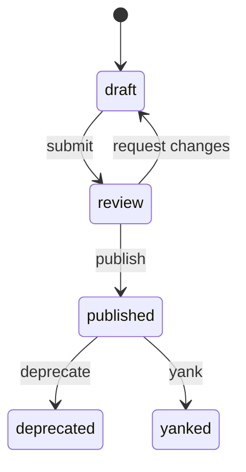

# Lifecycle States

## Why

Not every package version is ready for consumption. Drafts are being worked on, submitted versions are under review, published versions are immutable and trusted, and some versions need to be deprecated or yanked. Lifecycle states provide a clear governance workflow from creation to retirement.

## How

### State Diagram



### States

| State | Mutable? | Visible in Search? | Resolvable by Selectors? | Description |
|---|---|---|---|---|
| `draft` | Yes | No | No | Being created, artifacts being uploaded |
| `review` | No (content changes reset to draft) | No | No | Submitted for review, awaiting approval |
| `published` | No | Yes | Yes | Immutable, publicly available |
| `deprecated` | No | Yes (with filter) | Yes | Still fetchable but discouraged |
| `yanked` | No | No | Yes in the current MVP selector implementation | Hidden from search, fetchable by authorized clients |

### State Transitions

| From | Action | To | Who |
|---|---|---|---|
| `draft` | Submit for review | `review` | Maintainer |
| `review` | Request changes | `draft` | Reviewer |
| `review` | Publish after enough approvals | `published` | Maintainer |
| `published` | Deprecate | `deprecated` | Maintainer |
| `published` | Yank | `yanked` | Admin or maintainer |

### Key Rules

- **Drafts are mutable** — you can upload, replace, and delete artifacts freely
- **Published versions are immutable** — no content changes after publish
- **Content changes reset reviews** — modifying a submitted version returns it to draft and invalidates approvals
- **Self-approval is blocked** — the same actor cannot approve their own submission
- **Yanked versions stay fetchable** — locked projects can still reproduce by exact version or digest

### Example: Publishing a Version

```bash
# 1. Create a draft
POST /api/v1/packages/nwks/platform/agent-backend/versions
{ "version": "1.1.0", "visibility": "private" }

# 2. Upload artifacts (tar.gz or individual files)
PUT /api/v1/packages/nwks/platform/agent-backend/versions/1.1.0/artifacts/Trovefile

# 3. Submit for review
POST /api/v1/reviews/nwks/platform/agent-backend/versions/1.1.0/submit

# 4. Reviewer approves
POST /api/v1/reviews/{reviewId}/approve

# 5. Maintainer publishes
POST /api/v1/packages/nwks/platform/agent-backend/versions/1.1.0/publish
```

### Next Steps

- Understand how [Visibility](/concepts/visibility) interacts with lifecycle states
- See the full [Upload & Publish Flow](/publishing/upload-publish-flow)
